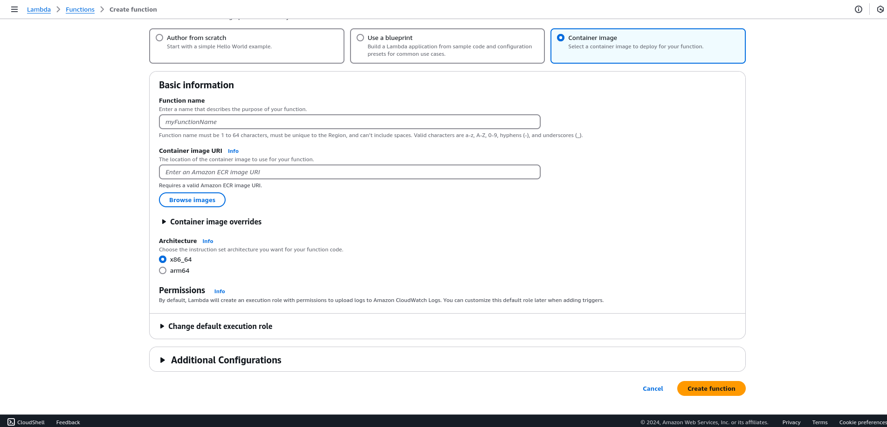
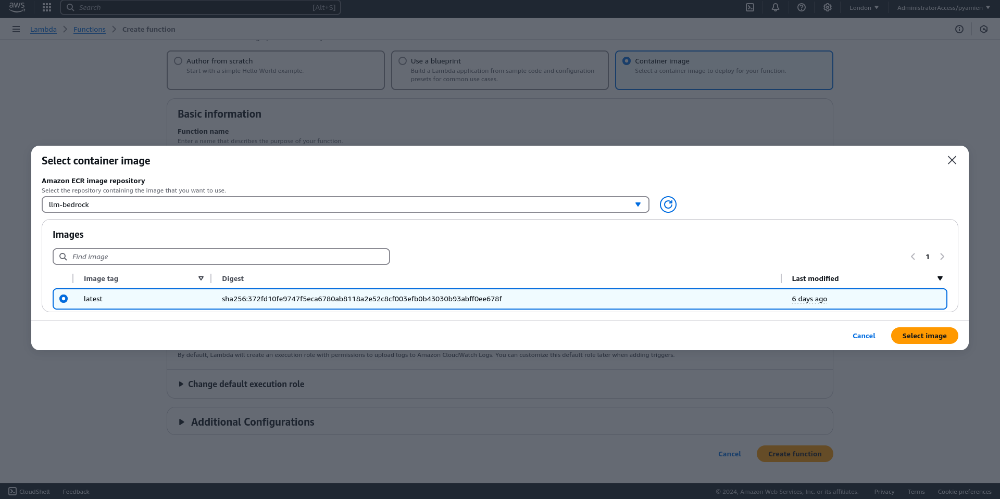
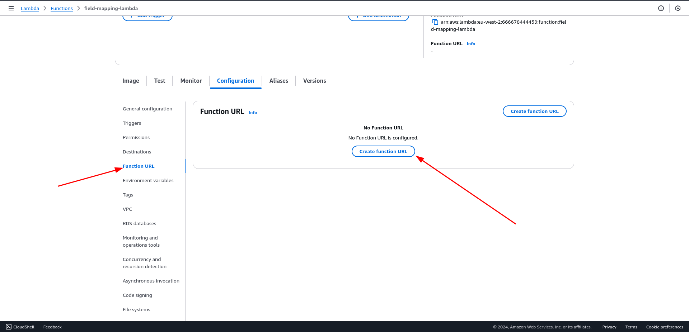
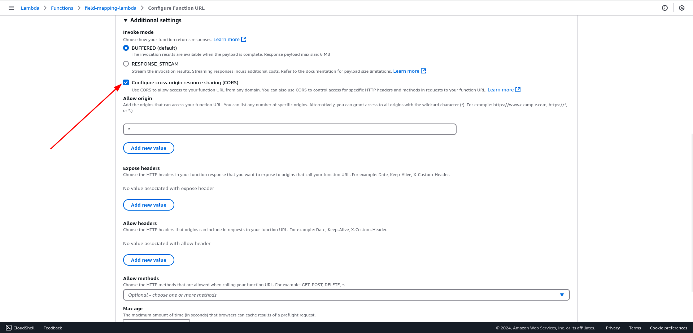
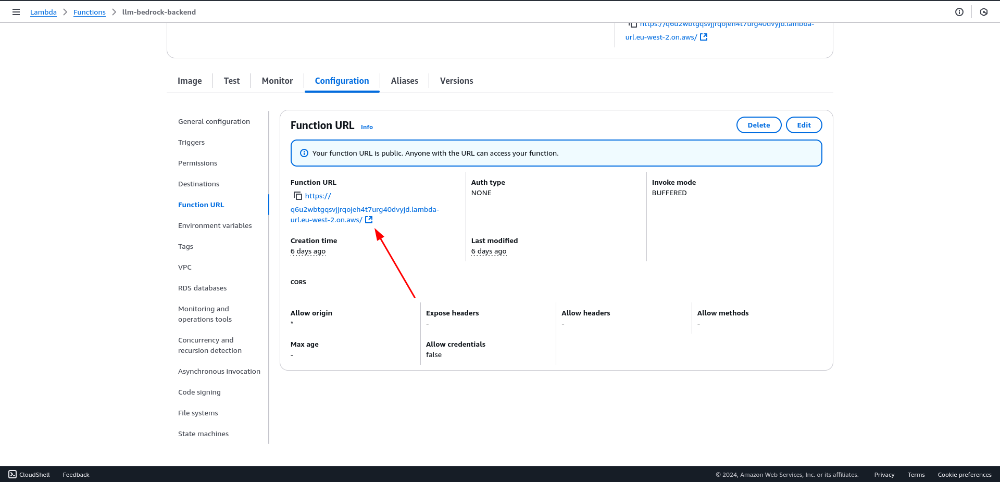
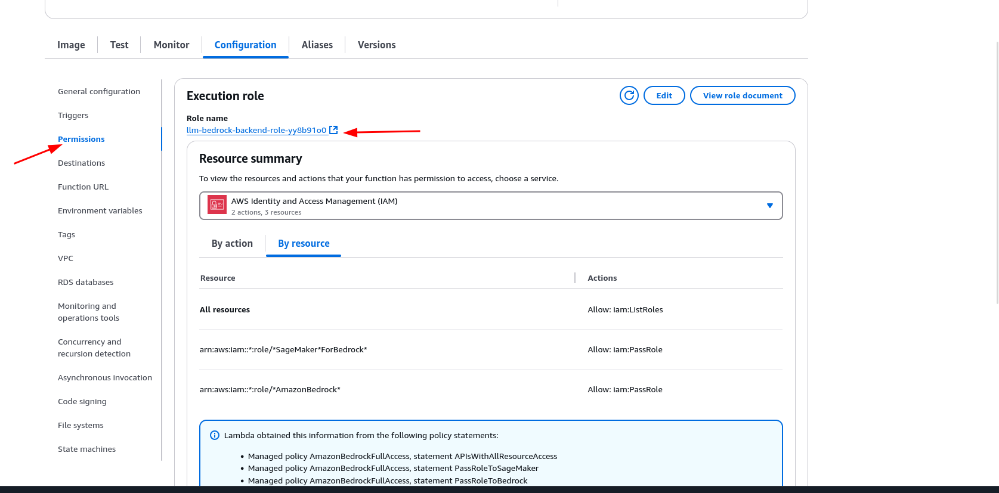
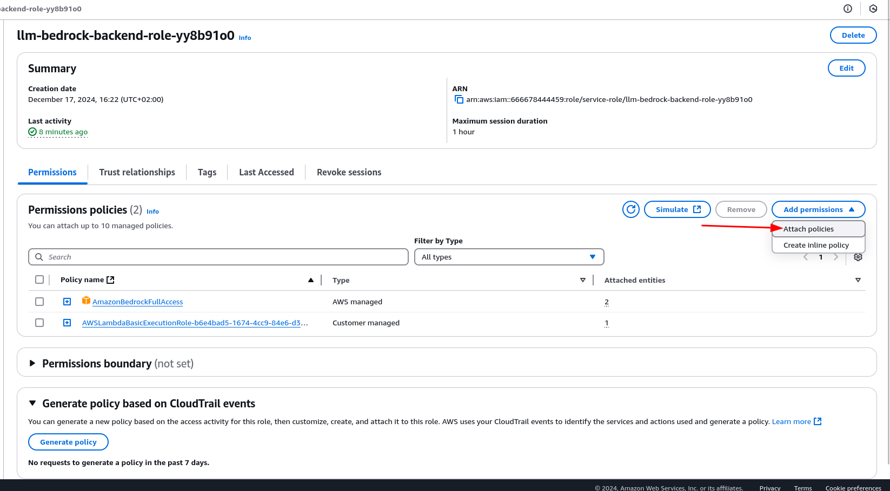
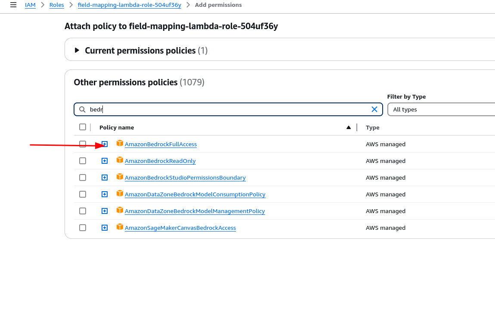

Field Mapping Service

A FastAPI application that uses AWS Bedrock to generate field mappings based on input data fields.

## Prerequisites

- Python 3.11+
- AWS credentials configured with access to Bedrock
- Docker (for containerization)

## Local Development Setup

1. Install dependencies:

```bash
pip install -r requirements.txt
```

2. Run the application:

```bash
python main.py
```

## Running Tests

```bash
pytest tests/
```

## API Usage

Send a POST request to `/generate-mapping` with the following JSON structure:

```json
{
  "Account_name": "example_account",
  "Root_directory": "example_directory",
  "Excel_data_fields": ["field1", "field2"]
}
```

To run using HTTPie:

```bash
http POST  http://0.0.0.0:8080/generate-mappings \
    Content-Type:application/json \
    Account_name=TestAccount \
    Root_directory=test_dir \
    Excel_data_fields:='["field1", "field2"]'
```

The response will be:

```json
{
  "Account_name": "example_account",
  "Root_directory": "example_directory",
  "field_mappings": {
    "field1": "mapped_field1",
    "field2": "mapped_field2"
  }
}
```

## Docker Deployment

1. Build the Docker image:

```bash
docker build -t llm-bedrock:latest .
```

2. Tag and push the image to Amazon ECR:

```bash
aws ecr get-login-password --region eu-west-2 | docker login --username AWS --password-stdin 666678444459.dkr.ecr.eu-west-2.amazonaws.com


docker tag llm-bedrock:latest 666678444459.dkr.ecr.eu-west-2.amazonaws.com/llm-bedrock:latest

docker push 666678444459.dkr.ecr.eu-west-2.amazonaws.com/llm-bedrock:latest
```

3. Create a Lambda function using the container image and configure the function URL for HTTP access.

## Lambda Deployment and URL Configuration

Follow these steps to deploy the Lambda function using the container image and configure the function URL for HTTP access.

1. **Create a new Lambda function:**

   - Go to the AWS Lambda console.
   - Click on "Create function".
   - Select "Container image" as the function type.
   - Click on "Choose container image" (see `choose_none.png`).

   

2. **Configure the container image:**

   - In the "Container image" section, select "bedrock registry" then select the container image you pushed to Amazon ECR.
   - Click on "Create function" (see `create_lambda.png`).

   

3. **Configure the function URL:**

   - After the function is created, go to the "Configuration" tab.
   - Select "Function URL" from the left-hand menu.
   - Click on "Create function URL" (see `create_url.png`).

   

4. **Configure cross-origin resource sharing (CORS):**

   - In the "Function URL" section, configure CORS settings to allow cross-origin requests if needed (see `select_cross_origin.png`).

   

5. **Get the function URL:**

   - Once the function URL is created, you will see the URL in the "Function URL" section.
   - Copy the URL for later use (see `get_url.png`).

   

Your Lambda function is now deployed and configured with a function URL for HTTP access. 6. **Select a policy from the Permissions tab:**

- Go to the "Configuration" tab of your Lambda function.
- Select "Permissions" from the left-hand menu.
- Click on "Add permissions" and then "Attach policies" (see `select_policy.png`).



6. **Add a policy to the Lambda function:**

   - Go to the "Configuration" tab of your Lambda function.
   - Select "Permissions" from the left-hand menu.
   - Click on "Add permissions" and then "Attach policies" (see `select_attach_policy.png`).

   

7. **Attach the Bedrock access policy:**

   - In the "Attach policies" section, search for the policy that grants access to Bedrock services.
   - Select the appropriate policy (e.g., `BedrockAccessPolicy`) and click "Attach policy" (see `select_bedrock_access.png`).

   
